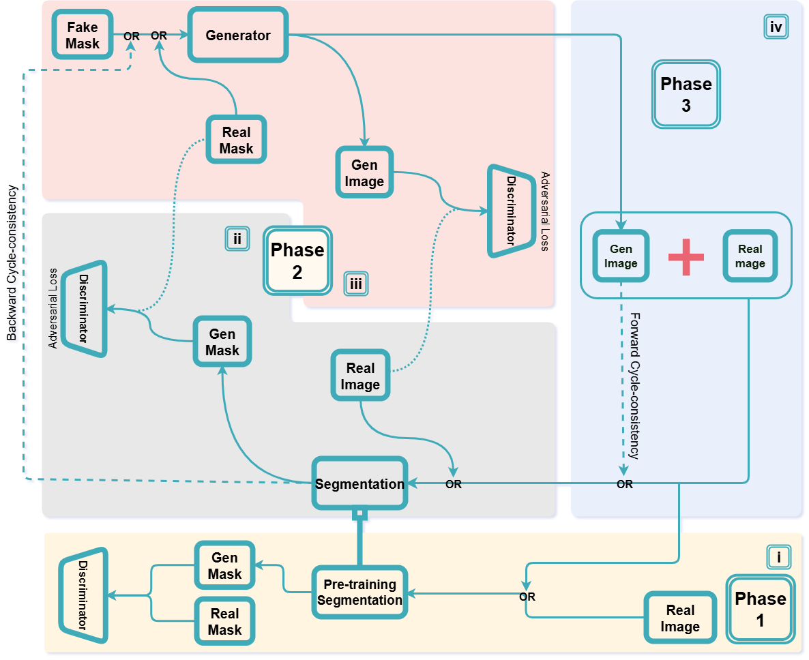

# MAGNet

MAGNet (Morphology-Aware Generative Network) is our proposed framework for accurate nanoparticle segmentation in electron microscopy (EM) images under data-scarce conditions.
The model comprises a self-attention U-Net trained from scratch on a limited set of real EM images to capture morphology-specific nanoparticle structures while suppressing background noise.
This pretrained segmentation model is then embedded into a CycleGAN-inspired generative framework (cGAN-Seg), enabling the synthesis of realistic EM image–mask pairs that are structurally consistent through cycle consistency loss.

By coupling segmentation and generation in a unified framework, MAGNet achieves morphology-aware, data-efficient segmentation and robust generalization, even with extremely limited training samples.

# Dataset

The EM dataset used in this study consists of WO₃ nanoparticle images curated and annotated in-house.
Due to institutional and data-sharing restrictions, the dataset is not publicly available, but can be accessed upon reasonable request to the corresponding author.

# Requirements

Install the requirements using the following code:

<pre>pip install -r requirements.txt</pre>
Utilization

# Training MAGNet

MAGNet can be trained on either your own EM dataset or the internal WO₃ dataset (available upon request). Prior to training, users are advised to configure key hyperparameters, including the choice of segmentation architecture (AttentionUNet or UNet) and the early stopping patience parameters. During training, the script records detailed logs and periodically saves model checkpoints for the segmentation network (Seg.pth), generator (Gen.pth), and discriminators (D1.pth and D2.pth) within the designated output_dir.

<pre>Example: python pretrain+finetune.py --seg_model AttentionUNET --train_set_dir .../dataset/train --lr 0.0001 --p_vanilla 0.2 --p_diff 0.2 --patience 500 --output_dir tmp/ </pre>

# Testing the segmentation model

Evaluate the segmentation model using your dataset, specifying the segmentation model type (seg_model) and its checkpoint directory (seg_ckpt_dir).

<pre>Example: python test_segmentation_model.py --seg_model AttentionUNET --test_set_dir .../dataset/test --seg_ckpt_dir .../MAGNet_checkpoints/Seg.pth --output_dir tmp/ </pre>

# Testing the generator model

Evaluate the StyleUNet generator’s performance using synthetic or real mask images.

<pre>Example: python test_generation_model.py --test_set_dir .../dataset/test/ --gen_ckpt_dir .../MAGNet_checkpoints/Gen.pth --output_dir tmp/ </pre>

# Comparative Models

A few standard segmentation architectures like UNET, UNET++, DCUNET, etc., and generation architectures like GAN and CycleGAN have been implemented for comparison within our designed pipeline, including the data augmentations used in our proposed model. These scripts can be found in the folder named “comparative_models”.

# Useful Information

For access to the private dataset or for any queries, contact varunajith29@gmail.com
 / anindyapal264@gmail.com
.

# Citation

If you reference this work, please cite:

<pre> @article{ajith2025magnet, title={MAGNet: Morphology-Aware Generative Network for Nanoparticle Electron Microscopy Segmentation}, author={Ajith, Varun and Pal, Anindya and [Co-authors]}, journal={Under review}, year={2025} } </pre>
License

This repository is distributed under the MIT License. See the LICENSE file for details.
